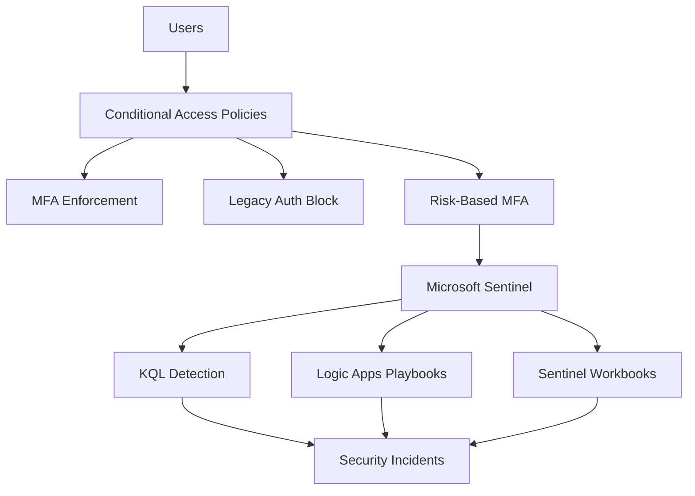

# Zero Trust IAM + Microsoft Sentinel

**Risk-Based Policies ▸ Conditional Access ▸ KQL Detection ▸ Playbooks ▸ Workbooks**

TL;DR: Designed and implemented end-to-end Zero Trust IAM security using Microsoft Entra ID Conditional Access, Microsoft Sentinel detection engineering, Logic Apps automation, and Sentinel workbooks.

**Focus:** MFA enforcement, legacy auth blocking, risk-based access, KQL detection, automated response, SOC dashboards.

---

## 🟦 Why This Project Matters to IAM 

Conditional Access is the core enforcement engine of Zero Trust. Microsoft Sentinel is the SOC's central nervous system.  
Most candidates show only one — this project proves **both**.

**What this proves I can do:**

✔ Enforce MFA for every sign-in  
✔ Block legacy authentication protocols  
✔ Implement risk-based Conditional Access  
✔ Use group-based governance (not user targeting)  
✔ Maintain break-glass resilience  
✔ Write KQL detection queries  
✔ Create Sentinel analytics rules  
✔ Automate incident response with Logic Apps  
✔ Build SOC dashboards with Sentinel workbooks  
✔ Capture evidence as proof of implementation  

**This aligns with expectations for:**

🟦 IAM Analysts  
🟦 Identity Governance Specialists  
🟦 SOC Analysts  
🟦 Detection Engineers  
🟦 Azure Security / Entra Engineers  
🟦 Security Automation Engineers  

---

## 📚 Table of Contents

- [Project Overview](#project-overview)
- [Zero Trust Requirements](#zero-trust-requirements)
- [Architecture](#architecture)
- [Groups Created](#groups-created)
- [Conditional Access Policies](#conditional-access-policies)
- [Detection Engineering](#detection-engineering-kql--analytics)
- [Playbooks & Automation](#playbooks--automation)
- [Workbooks & Dashboards](#workbooks--dashboards)
- [Evidence by Phase](#evidence-by-phase)
- [What I Learned](#what-i-learned)
- [Repo Structure](#repo-structure)
- [Skills Demonstrated](#skills-demonstrated)

  ## 📚 Table of Contents

- [Project Overview](#project-overview)
- [Zero Trust Requirements](#zero-trust-requirements)
- [Architecture](#architecture)
- [Conditional Access Policies](#-conditional-access-policies)
- [Detection Engineering](#detection-engineering)
- [Playbooks and Automation](#playbooks-and-automation)
- [Workbooks and Dashboards](#workbooks-and-dashboards)
- [Evidence by Phase](#evidence-by-phase)
- [What I Learned](#what-i-learned)
- [Repo Structure](#repo-structure)
- [Skills Demonstrated](#skills-demonstrated)

---

## 🎯 Project Overview

| Goal | Result |
|------|--------|
| Require MFA for every user | ✅ Enforced |
| Block legacy authentication | ✅ SMTP / IMAP / POP / ActiveSync blocked |
| Implement risk-based MFA | ✅ Medium + high sign-in risk |
| Maintain break-glass paths | ✅ Resilient |
| Group-based assignment | ✅ No direct user targeting |
| KQL detection for failed logins | ✅ Custom analytics rule |
| Automated incident response | ✅ Logic App playbook |
| SOC dashboards | ✅ Sentinel workbook with 5 visuals |
| Capture screenshots as audit evidence | ✅ Completed (27 screenshots) |

---

## 🛡 Zero Trust Requirements

This project matches Microsoft's official Zero Trust model:

🔹 **Verify Explicitly** — MFA, location, client, risk  
🔹 **Least Privilege Access** — groups, not users  
🔹 **Assume Breach** — legacy auth blocked, break-glass protected, detection + automation active  

---

## 🏗 Architecture




---


---

##  Conditional Access Policies

| Policy | Assignments | Conditions | Grant |
|--------|-------------|------------|-------|
| **Require MFA for Employees** | Employees group (BreakGlass excluded) | All cloud apps | Require MFA |
| **Block Legacy Authentication** | All users (BreakGlass excluded) | Client apps: Exchange ActiveSync, IMAP, POP, SMTP | Block access |
| **Require MFA for Risky Sign-in** | All users (BreakGlass excluded) | Sign-in risk: Medium + High | Require MFA |


---

## 🔍 Detection Engineering (KQL + Analytics)

| Detection | KQL Query | Analytics Rule |
|-----------|-----------|----------------|
| Failed login brute force | `SigninLogs \| where ResultType !=0 \| summarize FailedAttempts = count() by UserPrincipalName, bin(TimeGenerated,5m) \| where FailedAttempts >5` | Multiple Failed Sign-ins Detection (Medium severity) |
| Privileged role addition | `AuditLogs \| where OperationName contains "Add member to role"` | (Planned) |
| Client app distribution | `SigninLogs \| summarize count() by clientAppUsed` | (Informational) |

**All queries tested and active in Sentinel.**

---

## 🤖 Playbooks & Automation

| Component | Configuration |
|-----------|---------------|
| **Trigger** | When a Microsoft Sentinel incident is created |
| **Actions** | Get incident details → Add comment → Update tags → Send email |
| **Automation Rule** | Severity ≥ Medium → Run playbook |

**Validation:** Test incident triggered playbook within 2 minutes. Run history shows successful execution.

---

## 📊 Workbooks & Dashboards

| Visual | KQL Query | Purpose |
|--------|-----------|---------|
| Failed logins timechart | `SigninLogs \| where ResultType !=0 \| summarize by bin(TimeGenerated,1h)` | Detect brute force patterns |
| Top risky users (bar chart) | `SigninLogs \| summarize count() by UserPrincipalName \| top 5` | Identify targeted accounts |
| Location map (pie chart) | `SigninLogs \| extend Location = strcat(LocationCity,", ",LocationCountry) \| summarize count() by Location` | Geographic threat visibility |
| Incident trend | `SecurityIncident \| summarize count() by bin(TimeGenerated,1d)` | SOC workload tracking |

**Full dashboard saved and operational in Sentinel.**

---

## 🧾 Evidence by Phase

All screenshots available in phase folders under `/screenshots/`.

| Phase | Screenshots | Count |
|-------|-------------|-------|
| Phase 1: Users & Groups | `users-created.png`, `groups-created.png` | 2 |
| Phase 2: Conditional Access | `ca-employees-*.png` (4), `ca-block-legacy-*.png` (3), `ca-risky-*.png` (3), `ca-policy-list.png` | 11 |
| Phase 3: Detection | `kql-*.png` (3), `analytics-rules-list.png`, `incident-*.png` (2) | 6 |
| Phase 4: Playbooks | `playbook-designer.png`, `playbook-run-history.png`, `automation-rule.png` | 3 |
| Phase 5: Workbooks | `workbook-*.png` (5) | 5 |
| **Total** | | **27** |

---

## 🧠 What I Learned

✔ Conditional Access must be group-based to scale — no direct user assignment  
✔ Legacy auth must be explicitly blocked — NOT automatic  
✔ Break-glass paths must be excluded or companies lock themselves out  
✔ Named locations are required for geo-restriction (planned for v2)  
✔ KQL detection rules require tuning to avoid false positives  
✔ Logic Apps playbooks need managed identities — no hardcoded credentials  
✔ Sentinel workbooks are only useful if someone monitors them

## 📂 Repo Structure

```
zero-trust-iam-sentinel/
│
├── README.md
├── .gitignore
├── LICENSE
├── SECURITY.md
│
├── phase1_users_groups/
│   ├── README.md
│   └── screenshots/
│
├── phase2_conditional_access/
│   ├── README.md
│   └── screenshots/
│
├── phase3_detection_engineering/
│   ├── README.md
│   ├── KQL_queries/
│   └── screenshots/
│
├── phase4_playbooks/
│   ├── README.md
│   └── screenshots/
│
└── phase5_workbooks/
    ├── README.md
    └── screenshots/
   ``` 
---


---

## 🧩 Skills Demonstrated

- Zero Trust access architecture using Microsoft Entra ID  
- Conditional Access policy design (MFA, legacy block, risk-based)  
- KQL detection engineering for failed logins and risky users  
- Microsoft Sentinel analytics rules and incident investigation  
- Azure Logic Apps playbooks for automated response  
- Sentinel workbooks for SOC visualization  
- Break-glass account strategy & privileged access safeguards  
- Security documentation aligned with enterprise IAM + SOC controls  

---


