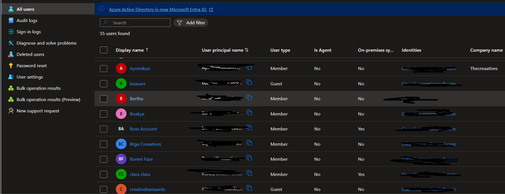
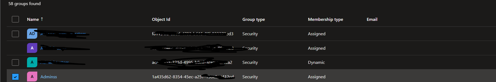

# Phase 1: Users & Groups

## Objective
Create security groups for policy assignment instead of direct user targeting.

## Zero Trust Principle Applied
**Least privilege** — access granted via group membership, not individual users.

## Implementation Steps
1. Created test user accounts for policy validation
2. Created three security groups: Employees, Admins, BreakGlass
3. Assigned users to groups based on role

## Evidence

| Component | Screenshot |
|-----------|------------|

## Technical Details

| Group Name | Purpose | Members |
|------------|---------|---------|
| Employees | Regular user access | Standard test users |
| Admins | Privileged access | Admin test users |
| BreakGlass | Emergency access | Excluded from all CA policies |

## Validation
- All groups visible in Entra ID → Groups blade
- Membership verified for each group
- BreakGlass group noted for policy exclusion

## Notes
BreakGlass group is excluded from all Conditional Access policies to prevent tenant lockout.
