# Phase 2: Conditional Access Policies

## Objective
Enforce MFA, block legacy authentication, and implement risk-based access controls.

## Zero Trust Principle Applied
**Verify explicitly** + **Assume breach**

## Implementation Steps
1. Created Policy 01: Require MFA for Employees
2. Created Policy 02: Block Legacy Authentication
3. Created Policy 03: Require MFA for risky sign-in

## Policies Summary

| Policy | Assignments | Conditions | Grant |
|--------|-------------|------------|-------|
| Require MFA for Employees | Employees group (BreakGlass excluded) | All cloud apps | Require MFA |
| Block Legacy Authentication | All users (BreakGlass excluded) | Client apps: Exchange ActiveSync, IMAP, POP, SMTP | Block access |
| Require MFA for risky sign-in | All users | Sign-in risk: Medium + High | Require MFA |

## Evidence

### Policy 01: Require MFA for Employees
| View | Screenshot |
|------|------------|
### Require MFA for Employees

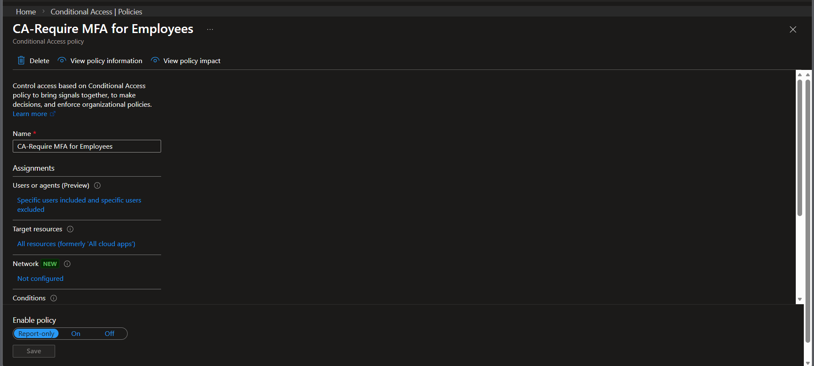
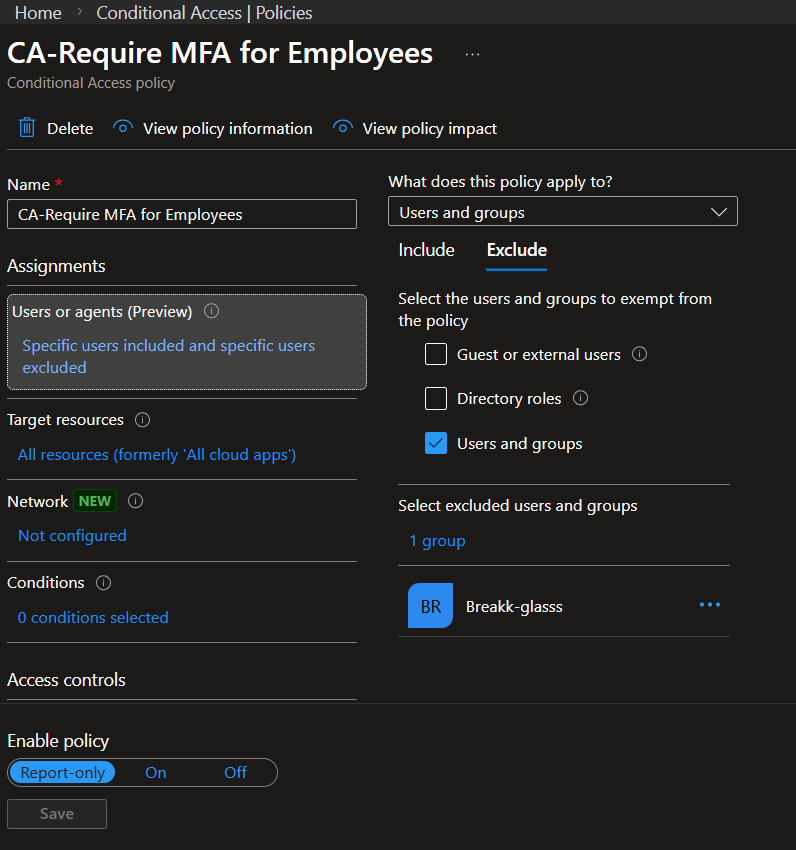
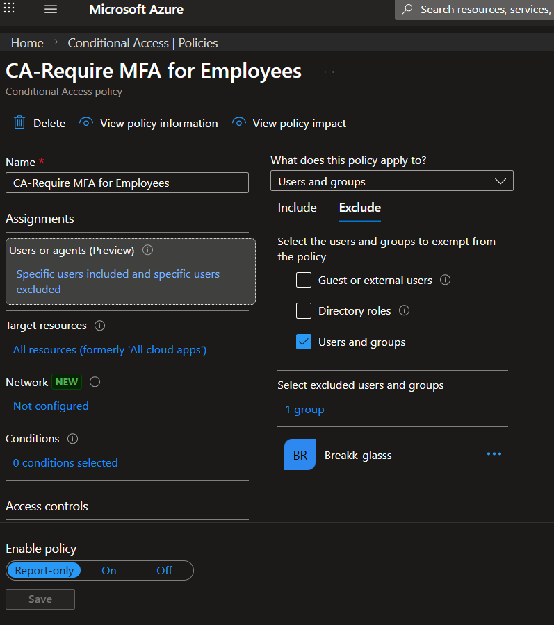
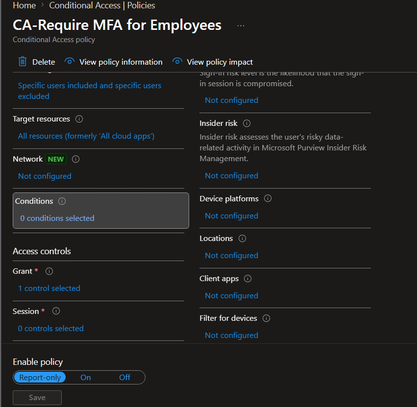
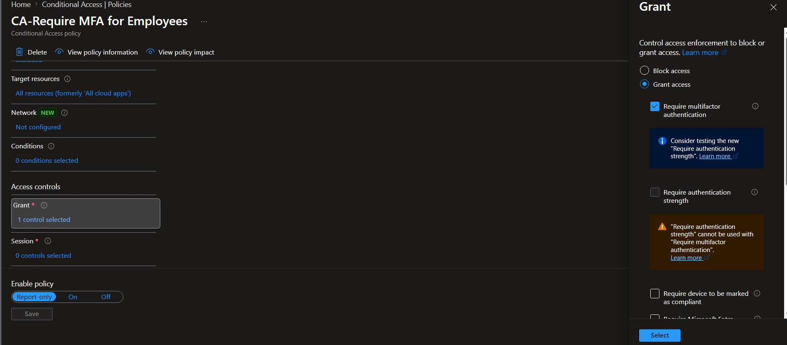

### Policy 02: Block Legacy Authentication
| View | Screenshot |
|------|------------|
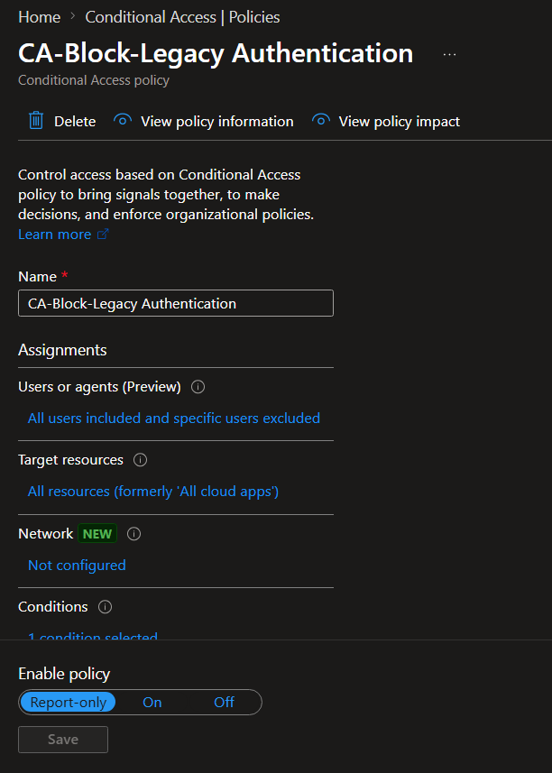
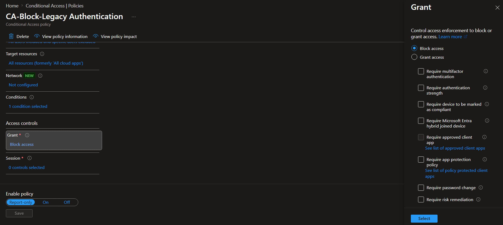
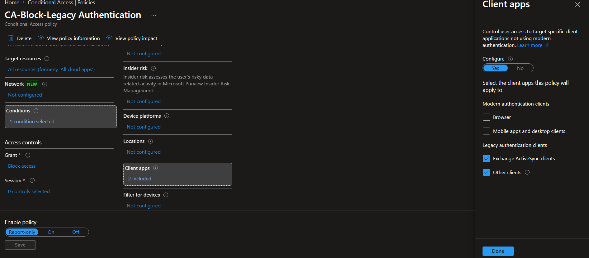

### Policy 03: Require MFA for Risky Sign-in
| View | Screenshot |
|------|------------|
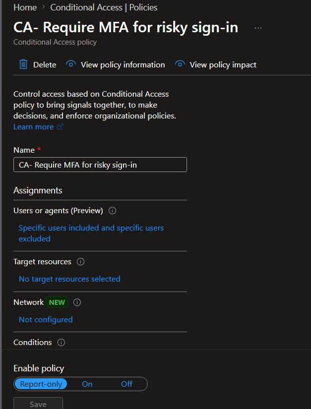
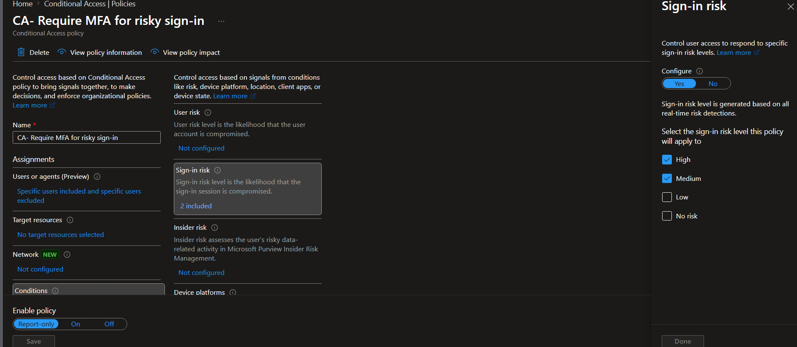
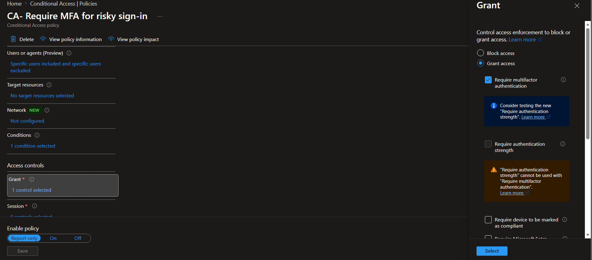

### Policy List
| View | Screenshot |
|------|------------|
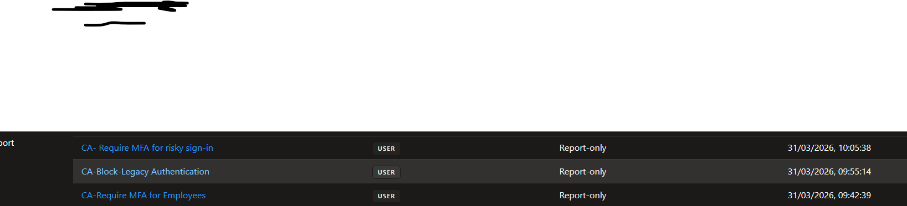

## Validation
- Employee test user: MFA prompted on first sign-in
- Legacy protocol attempt: Blocked (logs show failure)
- BreakGlass account: Excluded, no MFA required

## Notes
- BreakGlass group explicitly excluded from all policies
- Policies set to "On" (not Report-only)
- Named locations not implemented in this phase
