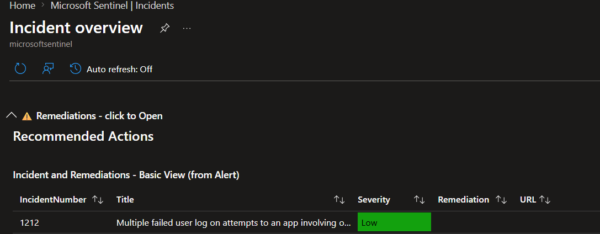
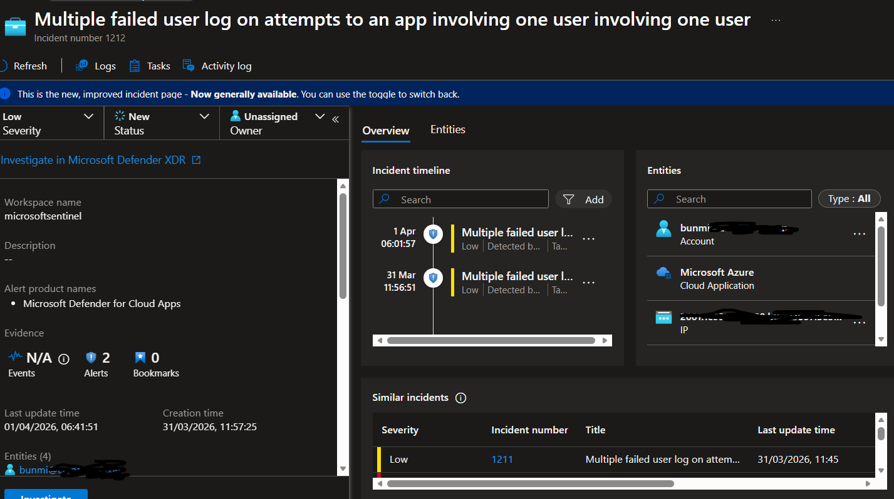

# Phase 3: Detection Engineering

## Objective
Create KQL-based analytics rules to detect failed logins, risky users, and suspicious activity.

## Zero Trust Principle Applied
**Assume breach** — detect anomalous behavior after access is granted.

## Implementation Steps
1. Wrote three KQL detection queries
2. Created analytics rules in Microsoft Sentinel
3. Tested queries against ingested sign-in logs
4. Verified incident creation

## KQL Queries

### Query 1: Failed Login Attempts
```kql
SigninLogs
| where TimeGenerated >= ago(1h)
| where ResultType != 0
| summarize FailedAttempts = count() by UserPrincipalName, bin(TimeGenerated, 5m)
| where FailedAttempts > 5
| extend Reason = "Multiple failed sign-ins in 5 minutes"

```

### Query 2: Privileged Role Addition (Risky Users Alternative)
```AuditLogs
| where TimeGenerated >= ago(24h)
| where OperationName contains "Add member to role"
| extend TargetUser = tostring(TargetResources[0].userPrincipalName)
| project TimeGenerated, TargetUser, OperationName

```

### Query 3: Client App Distribution
```SigninLogs
| where TimeGenerated >= ago(24h)
| summarize count() by clientAppUsed
| render piechart

```


---

## Evidence

| Component | Screenshot |
|----------|------------|
| KQL — Failed logins | |
| KQL — Client apps | |
| Analytics rules list | |
| Incident overview | |
| Incident detail | |

## Analytics Rules

| Rule Name | Purpose | Frequency | Severity |
|----------|----------|-----------|----------|
| Multiple Failed Sign-ins Detection | Detects brute-force login attempts using failed authentication patterns | Every 5 minutes | Medium |

## Validation

- Simulated failed logins: Alert triggered within 5 minutes
- Incident created with correct entities (UserPrincipalName, IP address)
- Incident severity mapped correctly to rule configuration

## Notes
- All queries tested in Sentinel Logs before creating analytics rules
- Rules enabled and actively monitoring

