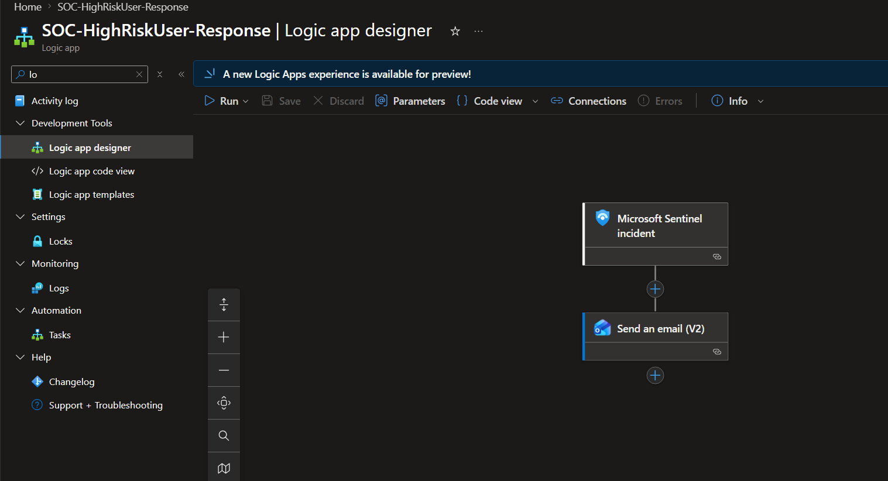
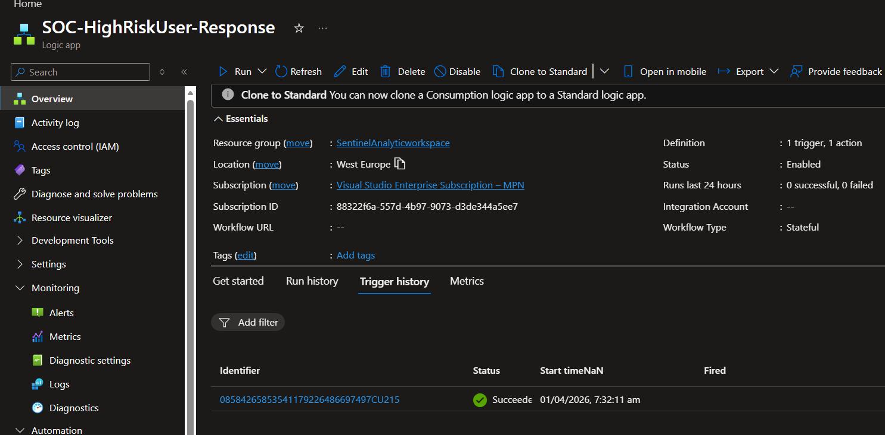
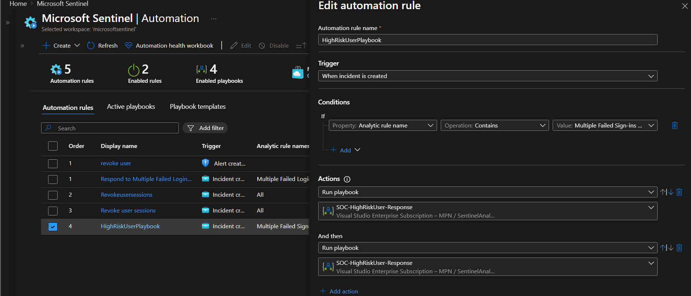

# Phase 4: Playbooks / Automated Response

## Objective

Automate incident response using Logic Apps triggered by Sentinel incidents.

## Zero Trust Principle Applied

**Assume breach** — automated containment and notification.

## Implementation Steps

1. Created Logic App playbook
2. Configured Sentinel automation rule
3. Tested end-to-end trigger → action flow

## Playbook Details

| Component | Configuration |
|-----------|---------------|
| Trigger | When a Microsoft Sentinel incident is created |
| Action 1 | Get incident details |
| Action 2 | Add comment to incident |
| Action 3 | Update incident tags |
| Action 4 | Send email notification (optional) |

## Automation Rule

| Setting | Value |
|---------|-------|
| Trigger | When incident is created |
| Condition | Severity ≥ Medium |
| Action | Run playbook |

## Evidence

| Component | Screenshot |
|-----------|------------|

## Validation

- Created test incident → playbook triggered within 2 minutes
- Incident comment added: "Automated response initiated"
- Incident tags updated with "Auto-investigated"
- Run history shows green checkmark (success)

## Notes

- Playbook uses managed identity (no hardcoded credentials)
- Requires Sentinel Contributor role on the workspace.
