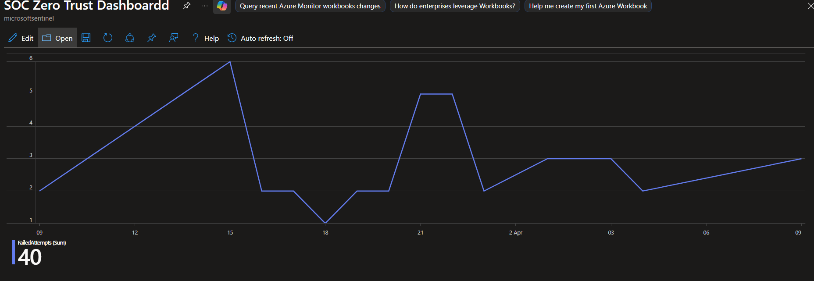
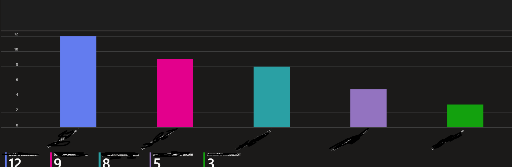
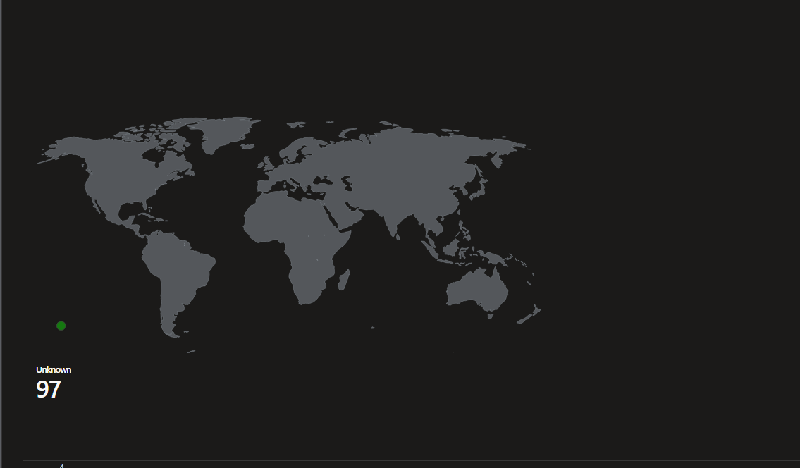

# Phase 5: Workbooks / Dashboards

## Objective
Visualize security metrics for SOC monitoring and incident response.

## Zero Trust Principle Applied
**Visibility** — you cannot defend what you cannot see.

## Implementation Steps
1. Created Sentinel workbook
2. Added KQL-based queries for each visualization
3. Saved and tested dashboard

## Visualizations Summary

| # | Visual | KQL Query | Purpose |
|---|--------|-----------|---------|
| 1 | Failed logins timechart | `SigninLogs \| where ResultType !=0 \| summarize by bin(TimeGenerated,1h)` | Detect brute force patterns |
| 2 | Top risky users (bar chart) | `SigninLogs \| where ResultType !=0 \| summarize count() by UserPrincipalName \| top 5` | Identify targeted accounts |
| 3 | Location map (pie chart) | `SigninLogs \| extend Location = strcat(LocationCity,", ",LocationCountry) \| summarize count() by Location` | Geographic threat visibility |
| 4 | Incident trend | `SecurityIncident \| summarize count() by bin(TimeGenerated,1d)` | SOC workload tracking |

## Evidence

| Visual | Screenshot |
|--------|------------|





## Sample Query — Failed Logins Timechart
```kql
SigninLogs
| where TimeGenerated >= ago(24h)
| where ResultType != 0
| summarize Count = count() by bin(TimeGenerated, 1h)
| render timechart

```

## Validation
- All charts populate with real sign-in data
- Time range selector works (last 24h, 7d)
- Workbook saves and reloads without error

## Notes
- Workbook uses Log Analytics workspace connected to Sentinel
- Requires at least 24 hours of data for meaningful trends
